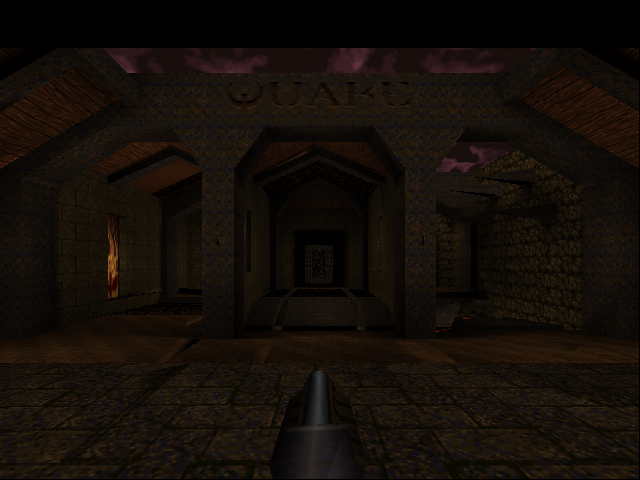
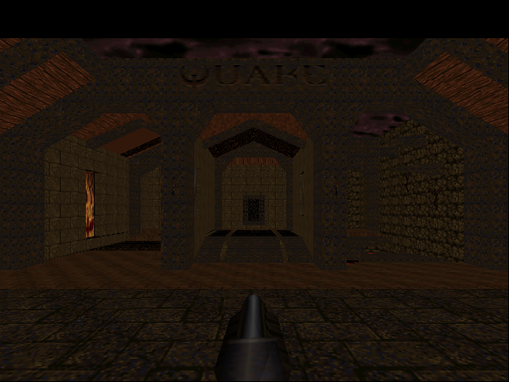
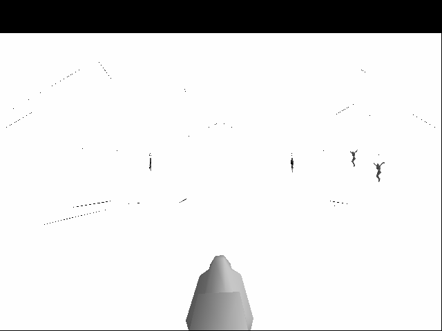
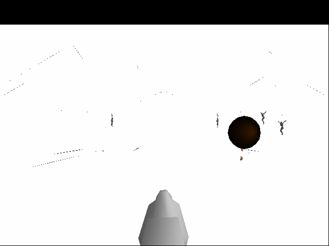

# GLQuake on the engine

The north star — **GLQuake runs on the hardware rasterizer, textured and
lightmapped.** It boots through full init, loads a map, spawns entities, meshes
the models, and renders the 3D world: the BSP geometry, the player's weapon
viewmodel, and the alias-model monsters — all **perspective-correct textured**,
**lightmapped**, and depth-tested, at ~2,300 triangles per frame through the
engine.



*The `start` map with textures **and** baked lighting — note the pools of light
on the floor, the falloff up the walls, and the shadowed recesses and ceiling.
Every pixel is the base texture, sampled and perspective-corrected by the engine,
then multiplied by Quake's lightmap in a second pass — exactly how GLQuake lit
the world on a 3dfx Voodoo.*

### How we got here (a progress log)

The same camera, a few steps back. With textures but **before lightmaps**, the
world was uniformly dim — every surface its base texture with no baked light, so
no sense of depth from the lighting:



Before that it rendered **untextured** — flat white modulated by vertex color.
The geometry, depth occlusion, and the weapon viewmodel were already real engine
output; textures were the missing piece (the thin lines are surface edges showing
through the flat fill):



And an alias-model entity (the shaded sphere) dropping into the scene with its
own depth and shading — proof the model path worked before textures did:



## How it's wired

Same approach as [GLGears](opengl-via-tinygl.html), one rung up in ambition. We
don't reimplement OpenGL: **TinyGL** is the GL front-end (transform, lighting,
clipping), and we replace only its software rasterizer with our engine
(`tgl_engine.cc`). GLQuake itself is built almost unmodified.

```
GLQuake  →  TinyGL (T&L, clip)  →  tgl_engine.cc (ZB_* backend)
         →  gfx → hw_rast → rasterize.sv  →  on-chip color + Z  →  SDL window
```

The GLQuake source is a fork ([dsheffie/hwrast-sdlquake](https://github.com/dsheffie/hwrast-sdlquake),
a clean SDLquake-1.0.9 base with the dead arch/OS code stripped) vendored as a
submodule. The only real new file is `gl_vid_tinygl.c` — an SDL2 + TinyGL +
engine video layer replacing the original X11/GLX one. See the
[miniGL design doc](minigl-design.html) for the full plan.

## Texturing: capture, residency, and a free perspective denominator

The engine has **one** texture memory; Quake binds hundreds of textures. So
`tgl_engine.cc` keeps a *residency* cache: it tracks which texture is loaded and
re-uploads only when the bound texture changes. Quake draws by texture chains, so
in practice that's ~24 uploads per frame (visible in the `texloads` heartbeat),
not one per triangle.

The texture data comes straight from TinyGL: GLQuake uploads `GL_RGBA` images,
TinyGL stores each as a 256² pixmap, and at draw time hands us the bound texture
via `ZB_setTexture`. We box-downsample that to the engine's 128² and let
`load_texture` build the mip chain.

The neat part is perspective correctness. TinyGL's screen depth `zp.z` (near =
large) is *affine in 1/w*, so it already **is** the perspective denominator —
TinyGL's own texturing computes `s·z ÷ z`. We feed the engine per-vertex
normalized `u,v` (decoded from `zp.s/zp.t`) and `invw = zp.z` (normalized per
triangle to keep the fixed-point setup well-conditioned). The engine's
`interp(u·z)/interp(z)` then reproduces TinyGL's mapping exactly — no projection
matrix to peek at, no extra clip-space data to carry.

## Lightmaps: a second multiply pass

GLQuake lights the world with **lightmaps** — low-res baked-light textures, one
luxel per ~16 surface texels. With `gl_texsort` on (the default), the world is
drawn in two passes: `DrawTextureChains` lays down every base texture opaque,
then `R_BlendLightmaps` re-draws the same surfaces sampling the lightmap and
*multiplying* it into what's already in the framebuffer
(`glBlendFunc(GL_ZERO, GL_ONE_MINUS_SRC_COLOR)`). That's how GLQuake ran on a
single-texture Voodoo, and it's exactly our engine's situation: **one** texture
unit, so we do the same two passes.

Three small pieces made it work:

1. **A modulate blend mode.** The engine had opaque / src-over / additive; we
   added mode 3 = `dst · src` (`rasterize.sv`). Quake stores lightmaps *inverted*
   (`255 − light`) and blends with `ONE_MINUS_SRC_COLOR`; we un-invert on upload
   instead, so a plain multiply gives `dst · light`.
2. **`<=` depth for the overlay.** The lightmap pass is the *same geometry* as
   the base pass, so its fragments land at exactly equal depth. The opaque test
   is strict `<` (no coplanar z-fighting); blended passes use `<=` so the overlay
   passes. (Only opaque writes depth, matching GLQuake's `glDepthMask(0)` for the
   lightmap pass.) This one line is why lightmaps appear at all — before it, the
   coplanar pass was silently killed by the depth test.
3. **LUMINANCE upload.** Lightmaps arrive as single-channel `GL_LUMINANCE`;
   TinyGL now accepts that, expanding to gray and un-inverting in one step.

`tgl_engine.cc` picks the engine blend mode from TinyGL's `glBlendFunc` state
(`zb->sfactor/dfactor`), so the lightmap multiply, additive glows, and alpha
blends each map to the right mode. Static lighting only for now — Quake's dynamic
light updates go through `glTexSubImage2D`, which we don't yet honor.

## Build and run

```sh
make quake
./quake -basedir /path/to/quake +map start     # opens an SDL window
```

It's **slow** — cycle-accurate Verilator, seconds-to-minutes per world frame. The
first ~40 frames are 2D loading screens (black); the 3D view starts around frame
41. Useful knobs:

```sh
HW_STATS=1 ./quake ...                                  # per-frame triangle heartbeat
SDL_VIDEODRIVER=dummy SDL_AUDIODRIVER=dummy \
  GEN_FRAME_PPM_FILES=1 HW_MAX_FRAMES=50 ./quake ...    # headless: dump frameNNNN.ppm
```

The **heartbeat** turned out to be the key diagnostic — it prints triangles
rasterized (and now texture uploads) per frame, which instantly distinguishes a
black loading screen from the real world view and confirms geometry is reaching
the engine:

```
[hb] frame 40:     0 tris,    0 texloads   ← loading screen (nothing drawn)
[hb] frame 41:  2313 tris,   24 texloads   ← the 3D world appears
[hb] frame 45:  2308 tris,   24 texloads
```

## Learnings (the hard-won bugs)

Getting an unmodified 1996 game engine onto a 64-bit host + a brand-new GL/
rasterizer backend surfaced a sequence of instructive failures:

### 1. The 32-bit-pointer assumption (the QuakeC VM crash)

Quake stores engine-side strings as a 32-bit `string_t` that's really an offset:
`ptr - pr_strings`. That's fine when everything lives close together in memory —
which it does on a compact embedded/rv64 layout. On x86-64 with a `malloc`'d
heap, the heap is `mmap`'d **terabytes** away from the BSS statics, so
`ptr - pr_strings` overflows 32 bits and truncates to garbage. The first
QuakeC string compare (`strcmp(pr_strings + a->string, ...)`) then dereferences
nonsense and segfaults — deep in the bytecode interpreter, far from the real
cause.

**Fix:** put Quake's heap in **BSS** (a static array) instead of `malloc`, so
`pr_strings` and the static string buffers stay within `int` range of each other.
A one-line change, once you understand *why* the same code runs on rv64 but not
x86-64. (The interpreter itself is the portable generic C path — not the bug.)

### 2. A fixed-size array overflow into global state (the render crash)

TinyGL accumulates a primitive's vertices in `GLContext.vertex[POLYGON_MAX_VERTEX]`,
which defaulted to **16** (and `GL_POLYGON` support was off entirely). GLQuake
draws every surface with `glBegin(GL_POLYGON)`, and big brush faces have far more
than 16 vertices. The overflow ran straight off the end of `vertex[]` into the
adjacent `shared_state` — corrupting the **texture hash-table pointer**. The crash
then showed up at the *next* `glBindTexture`, with a wild pointer, looking nothing
like a vertex overflow.

The heartbeat + a one-line print of the corrupted field (`tbl=0x80000000fffff4b1`)
pinned it: the table pointer was valid right up until one surface was drawn, then
garbage. **Fix:** enable `GL_POLYGON` and raise `POLYGON_MAX_VERTEX` to 256.

### 3. Impedance-mismatched texture management

GLQuake uploads `GL_RGBA`, mipmapped, arbitrarily-sized textures and binds
*hundreds* of integer texture names without `glGenTextures`. TinyGL only accepts
`GL_RGB`/level-0/256². The fix was to teach TinyGL's `glTexImage2D` to accept
`GL_RGBA` (strip the alpha) at level 0 and ignore the mip levels — it already
resizes any size to 256², so the stored pixmap is exactly what we sample. Each
bound name gets its own `GLTexture` so its pixmap pointer is a stable key for the
engine-side residency cache. (The mip chain GLQuake uploads is discarded; the
engine builds its own.)

### Meta-lesson

Two of three show-stoppers were **a small mismatch crashing somewhere far away**
(a truncated offset → VM segfault; a vertex overflow → texture-bind crash). A
cheap, always-available signal — the per-frame triangle count — was worth more
than any single debugger session for localizing them.

## Status & next

- ✅ Boots, loads maps, renders the world + viewmodel + entity models, depth-tested.
- ✅ **Textured** — perspective-correct, with engine-side texture residency.
- ✅ **Lightmapped** — the base-texture × lightmap multiply pass, via a new
  engine modulate blend mode and a `<=` depth test for the coplanar overlay.
- ◻️ **Dynamic lights** — torches/explosions update lightmaps through
  `glTexSubImage2D` (currently a no-op), so lighting is static for now.
- ◻️ **Blending polish** — translucent water/glass alpha (per-vertex alpha isn't
  carried yet) and the scrolling sky.
