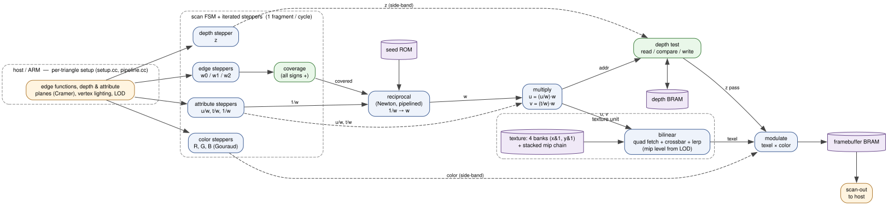

# Building a miniGL-class GPU, from a 2D triangle up

This site explains, from first principles, how the hardware rasterizer in the
[hw-rasterizer](https://github.com/dsheffie/hw-rasterizer) repo works — and how a
handful of small ideas compose into something that can run GLQuake-class content
(textured, lit, depth-buffered triangles) on an FPGA.

Each page introduces **one capability**, shows the math, and points at the code
that implements it. Read top to bottom, or jump around with the sidebar.

## The one idea: iterated linear functions

Almost everything a fixed-function rasterizer does is **evaluate a linear
function of the pixel position `(x, y)` at every pixel inside a triangle.**

A linear (affine) function on the screen is

```
f(x, y) = A·x + B·y + C
```

The trick is that you never compute that multiply per pixel. Step one pixel to
the right and the value changes by a **constant**:

```
f(x+1, y) − f(x, y) = A          (a constant: the x-gradient)
f(x, y+1) − f(x, y) = B          (a constant: the y-gradient)
```

So if you know `f` at a starting pixel, every other pixel is **one add**. That's
"forward differencing," and it's the whole game: set up the gradients `A, B` and
a start value once per triangle (the expensive part, with the divides), then
sweep the triangle adding `A` across each row and `B` between rows. Adders are
cheap and fast — that's why this maps so well to hardware.

The rest of this site is just *which* linear functions we iterate:

- **edge functions** → which pixels are inside the triangle (coverage)
- **depth `z`** → the depth buffer / hidden-surface removal
- **`u/w, t/w, 1/w`** → perspective-correct texture coordinates
- **per-vertex color** → Gouraud shading

and then the pieces that hang off them (texture memory, filtering, mipmaps,
the pipeline).

## The setup / iterate split

The design has two halves, and the split is what makes it hardware-friendly:

- the **host** (an ARM core) does the per-triangle **setup** — the cross
  products and the Cramer's-rule divides that produce the gradients — leaning on
  the CPU's floating point;
- the **PL** (the FPGA fabric) does the per-pixel **iteration** — just adders,
  one reciprocal, and comparisons, at one fragment per cycle.

Setup is a few dozen flops per triangle; iteration is the hot loop. Everything
below is an instance of this pattern.



*The whole datapath at a glance — see [The hardware pipeline](hardware-pipeline.html)
for the walkthrough.*

## Contents

1. [Edge functions & Pineda's algorithm](edge-functions.html) — coverage
2. [Sub-pixel coordinates](sub-pixel-coordinates.html) — where the edges land
3. [Barycentric coordinates](barycentric.html) — coverage → interpolation
4. [Iterated depth & the depth buffer](depth-buffer.html)
5. [Perspective-correct texture coordinates](perspective-texturing.html)
6. [Gouraud shading](gouraud-shading.html)
7. [Bilinear filtering & mipmapping](texture-filtering.html) — banking
8. [The hardware pipeline](hardware-pipeline.html)
9. [Toward miniGL](toward-minigl.html)
10. [Running the SGI demos](running-the-sgi-demos.html) — real IRIS GL demos on the engine
