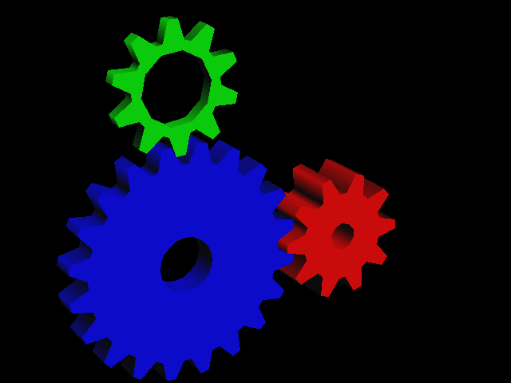

# Real OpenGL via TinyGL

The [SGI demos](running-the-sgi-demos.html) proved the engine against real IRIS GL
software. The next milestone is **real OpenGL** — the path to GLQuake — and it
works: the classic *GLGears* now renders on the hardware rasterizer.



*Lit, depth-tested, backface-culled GLGears — every pixel scanned out of the
engine's framebuffer.*

## How: swap only the rasterizer

We don't reimplement OpenGL. We vendor **[TinyGL](https://github.com/C-Chads/tinygl)**
(an OpenGL-1.1-subset software GL) and replace *only its software rasterizer* with
our hardware engine:

```
gears.c → TinyGL (glBegin/glVertex/glRotatef/…)
            ├─ transform · lighting · clipping (incl. near plane)   ← TinyGL, unchanged
            └─ ZB_fillTriangle* / ZB_line / ZB_plot                 ← OUR backend (tgl_engine.cc)
                  → submit_triangle → gfx → hw_rast → rasterize.sv
```

TinyGL still does all the geometry — matrix stack, per-vertex lighting, frustum
**and near-plane clipping** — and hands the low-level rasterizer final
screen-space vertices (`ZBufferPoint`). We provide our own `ZB_*` functions
(`tgl_engine.cc`) that forward those vertices to the engine. The trick is purely
at link time: build TinyGL's objects **minus** `ztriangle.o` and `zline.o`, so our
symbols win — **no TinyGL source is modified.**

`tgl_engine.cc` just decodes TinyGL's conventions into the engine's:

- `zp.x,zp.y` are whole pixels (perspective divide already done) → ×32 to the
  engine's [sub-pixel coordinates](sub-pixel-coordinates.html); `zp.y` is already
  top-down.
- depth `zp.z ∈ [0, 2³⁰]` with **near = large**, so we invert and rescale to the
  engine's 24-bit **near = small** buffer.
- per-vertex color → the engine's [Gouraud](gouraud-shading.html) planes;
  `glEnable(GL_DEPTH_TEST)` → the engine's per-triangle depth enable.

## This is the authentic miniGL split

Geometry/T&L in software on the CPU, rasterization in hardware — that's exactly
how GLQuake ran on a 3dfx Voodoo. The Voodoo had no transform engine; the Pentium
did T&L and the card only rasterized. So TinyGL-does-geometry / our-HW-rasterizes
isn't a shortcut, it's the right architecture for the target. (Hardware T&L is a
later GPU generation — see [Toward miniGL](toward-minigl.html).)

## Build and run

```sh
make tgl_gears
./tgl_gears --sdl        # live window (Esc/Q quit, Space pause)
./tgl_gears --frames N   # headless: dump tgl_gearsNNNN.ppm
```

It renders at 640×480 on the (Verilated) engine. The same backend is the seam we
point GLQuake at next — TinyGL becomes the in-tree "miniGL" driver, and the only
remaining engine-side work is wiring textured perspective fills and the blend
modes through `tgl_engine.cc`.
