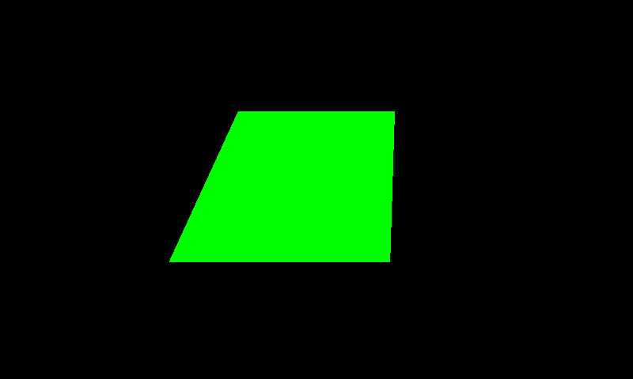
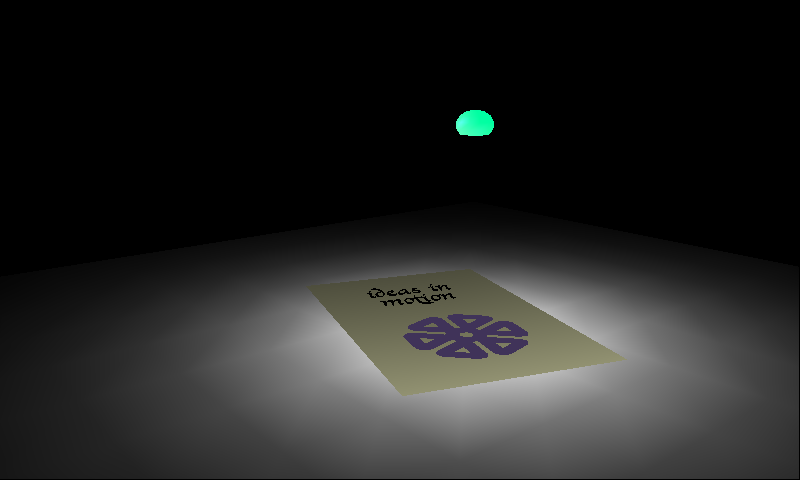
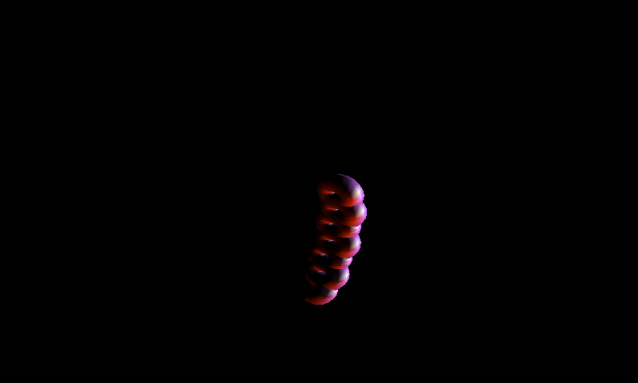
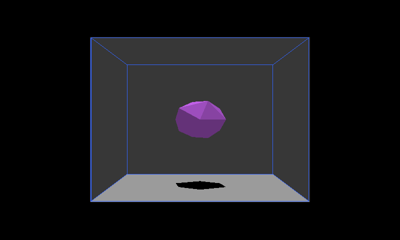
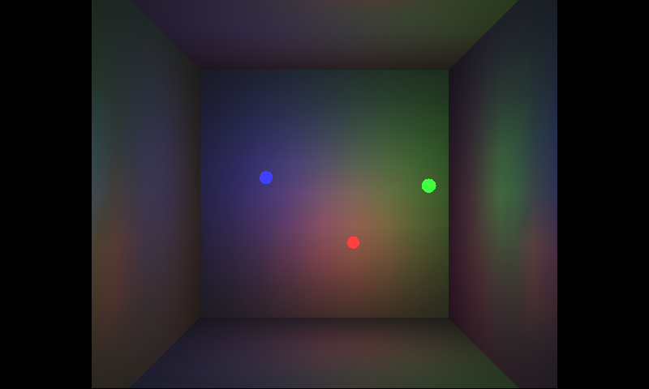
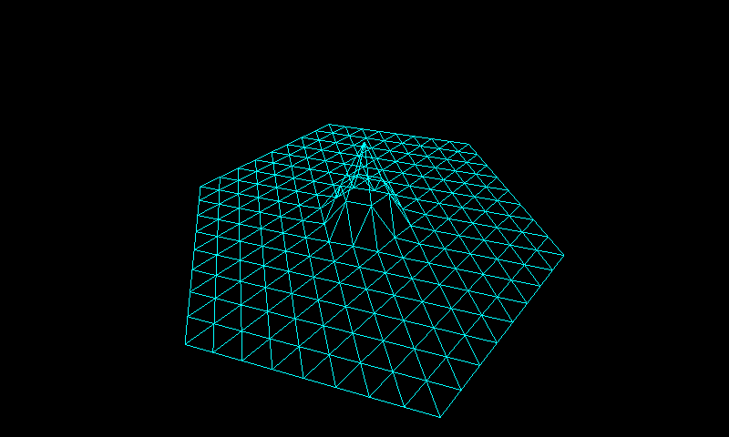

# Running the SGI demos

The best way to know a rasterizer works is to point real software at it. The
[sgi-demos](https://github.com/sgi-demos/sgi-demos) project is a modern,
buildable collection of the classic SGI IRIS GL demos. Their `libgl` talks to a
software rasterizer through a tiny backend interface (`rasterizer.h`), and we
implement that interface on **our** hardware engine instead of the reference C
rasterizer.

So the whole stack above the rasterizer runs **completely unmodified**:

```
demo (ideas, jello, …) → gl.c (IRIS GL) → rasterizer.h
                                              └── hw_rasterizer.cc  ← OUR backend
                                                     → gfx → hw_rast → rasterize.sv (Verilated RTL)
```

The only trick is at link time: we place our `hw_rasterizer.o` and the engine
objects *ahead* of `libgl.a`, so the linker resolves the `rasterizer_*` symbols
from us and never pulls in the demos' reference `reference_rasterizer.o`. No demo
source changes, no `libgl` changes.

## Building and running

Any demo under `sgi-demos/demos/` builds against the engine with one pattern
rule:

```sh
make ideas_hw      # or logo_hw, jello_hw, bounce_hw, gltest_hw, newave_hw, …
./ideas_hw         # needs a display (SDL window)
```

Headless capture (no display) — dump every frame as a PPM and exit after N:

```sh
SDL_VIDEODRIVER=dummy GEN_FRAME_PPM_FILES=1 HW_MAX_FRAMES=10 ./jello_hw
```

The demos render at **800×480** (SGI's `XMAXSCREEN`/`YMAXSCREEN`), larger than
the FPGA's 256² on-chip BRAM but free in the Verilated model — so this path
builds the engine non-square (`+define+SCREEN_WIDTH=800 +define+SCREEN_HEIGHT=480`),
while the FPGA build stays 256².

> **The slowness is a feature.** Cycle-accurate Verilator runs at roughly
> 10 s/frame (minutes for heavy scenes). That sounds painful, but it makes every
> visual glitch glaringly obvious frame-by-frame — you watch the hardware paint
> the image the way the silicon would.

## The gallery

Every image below is a **framebuffer dump straight off the engine** — the bytes
the RTL scanned out, not a reference render.

### gltest — the "hello triangle"



A single flat-shaded quad. No texture, no depth, no lighting — the minimal "does
GL reach the rasterizer at all" sanity check. If this is a solid green polygon,
coverage and the setup→iterate path are alive.

### ideas — *ideas in motion* (no z-buffer)



The headline demo: a card on a spotlit floor with a flower logo, an orb, and
text. The interesting part is that it draws almost everything with
**`zbuffer(FALSE)`** — classic **painter's algorithm**, back-to-front, with the
logo as a *coplanar decal* on top of the card. Our engine depth-tests by
default, so coplanar surfaces fought (z-fighting). The fix was a **per-triangle
`z_enable`** in the RTL (`depth test = ~z_enable | (depth < zold)`); the IRIS GL
backend simply forwards each `zbuffer()` call. See
[the depth buffer](depth-buffer.html). The spotlit floor is Gouraud-interpolated
vertex color.

### logo — the spinning SGI logo (z-buffered)



The iconic interlocking-tube logo, assembling itself segment by segment. This one
*does* use the depth buffer (`zbuffer(TRUE)`) and per-vertex lighting, so it's a
good check that depth test + Gouraud shading agree on a curved, self-occluding
solid.

### jello — a z-buffered room with a shadow



A wobbling blob bouncing inside a room. Three things at once: a **depth-buffered**
shaded solid, a **drop shadow** (projected geometry rendered as a dark polygon on
the floor), and **wireframe walls**. The wall edges are *lines* — our backend has
no dedicated line unit, so it expands every line (and point) into a 2-triangle
quad, which means wireframe comes "for free" from the triangle path.

### bounce — colored balls as lights



RGB balls bouncing in a dark room, each acting as a colored light source. The
walls and floor are Gouraud-shaded, so the red/green/blue pools of light are just
**interpolated vertex colors** — no per-pixel lighting hardware needed. Depth
test keeps the balls correctly in front of the walls.

### newave — a wireframe wave (all lines)



A triangulated surface drawn as pure cyan wireframe. This is the line path under
load: a whole mesh of edges, every one expanded to a quad. Good stress for the
line-to-triangle conversion and sub-pixel edge placement.

## What this exercises (and what's stubbed)

Running unmodified demos shook out real engine behavior:

- **Per-triangle depth enable** — IRIS GL toggles `zbuffer(TRUE/FALSE)` mid-frame
  (painter's vs. z-buffered); the engine now honors it per triangle.
- **Lines & points → quads** — no dedicated primitives; wireframe and points ride
  the triangle path.
- **Untextured Gouraud** — the backend binds a 1×1-ish white texture and lets the
  texel×color modulate pass vertex color straight through.
- **Sub-pixel coordinates** — vertices flow through at 1/32-pixel precision, so
  silhouettes (the logo, the orb) are smooth, not stair-stepped. See
  [sub-pixel coordinates](sub-pixel-coordinates.html).

A few backend entry points are still stubbed (so some demos render partially):
clear color is always black, and `rasterizer_bitmap`/`alpha_blit` (text glyphs)
are no-ops — most demo text happens to be polygons, so it still shows up. Heavy
demos (e.g. `insect`) build and run but are minutes-per-frame; arg-driven demos
(e.g. `sunflower <nseeds> <seedsize> <growth>`) need their command line.

Next: [Toward miniGL](toward-minigl.html) — what subset of GL it takes to run
GLQuake-class content.
